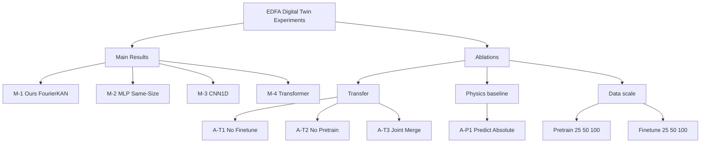

# EDFA Digital Twin — Experiments

This document is the paper-ready "Experiments" chapter: problem setup, datasets,
evaluation protocol, and the full matrix (Main results + Ablations) together
with the scripts used to produce them.

All numbers are generated automatically by

```bash
python scripts/run_all.py                    # run every experiments/**/*.yaml
python scripts/aggregate_results.py          # build tables under results/_tables/
```

and the tables referenced below live in `[results/_tables/](../results/_tables)`.

---

## 1. Experimental setup

### 1.1 Task

Given a single EDFA measurement, predict the per-channel **gain spectrum**
over 95 C-band WDM channels. The reference ground truth is the log-domain
ratio between the EDFA output and input power spectra.

### 1.2 Datasets


| Role          | Source                                                                      | #samples | Used by stage        |
| ------------- | --------------------------------------------------------------------------- | -------- | -------------------- |
| Pre-training  | COSMOS-EDFA (open-source) converted to Kaggle schema                        | 41 440   | `pretrain` / `joint` |
| Fine-tuning   | OFC 2026 ML Challenge Kaggle train (cleaned, `train_features_clean_1.csv`)  | 473      | `finetune` / `joint` |
| Held-out test | OFC 2026 ML Challenge Kaggle test (with post-competition `test_labels.csv`) | 21 056   | offline evaluation   |


The Kaggle train set is intentionally tiny (~0.5k rows), making the task a
**low-resource transfer learning** problem: most of the physical regularities
must be learned from the large COSMOS corpus. The test set is split into two
halves by the `Usage` column (Public / Private), matching the original Kaggle
leaderboard.

### 1.3 Feature preprocessing

Preprocessing follows `[src/ofc_ml/features.py](../src/ofc_ml/features.py)`:

1. dBm → linear mW on the 95 `EDFA_input_spectra_`* channels
2. `StandardScaler` on 4 numerical scalars (`target_gain`,
  `target_gain_tilt`, `EDFA_input_power_total`,
   `EDFA_output_power_total`)
3. One-hot encoding of `EDFA_type` and `edfa_index`
4. Pass-through of the 95-dim `DUT_WSS_activated_channel_index_*` mask
  (USE_MASK=concat)
5. The preprocessor is fit **once** on COSMOS ∪ Kaggle so the two training
  stages share identical feature statistics.

### 1.4 Target parameterization

Rather than predicting absolute gain directly, the model learns the
**residual offset** w.r.t. a physical baseline:

```
baseline_ij = target_gain_i + target_gain_tilt_i * (47 - j) / 94     # j=0..94
target_ij   = (label_ij - baseline_ij) * mask_ij
```

At inference time the offset is added back to the baseline.

### 1.5 Evaluation metrics

All metrics are masked (activated channels only) and implemented in
`[src/ofc_ml/evaluate.py](../src/ofc_ml/evaluate.py)`:

- **MAE / RMSE / MSE** — standard.
- **Kaggle Score** — the competition metric
  ```
  Score = MAE + 0.3 * T95 + 0.1 * Tmax + 0.15 * Std
  T95   = max(0, quantile95(|err|) - MAE - 0.5)
  Tmax  = max(0, max(|err|)         - quantile95(|err|) - 0.7)
  Std   = mean_i std_j(|err_ij|)     over activated j
  ```

We report Overall / Public / Private figures plus per-`Category`
(`aging / shb / unseen / cosmos`) and per-`EDFA_type` (`booster / preamp`)
breakdowns.

### 1.6 Training protocol


| Stage      | Loss       | Optimizer | LR   | Batch | Epochs (max) | Patience | Notes                    |
| ---------- | ---------- | --------- | ---- | ----- | ------------ | -------- | ------------------------ |
| `pretrain` | Masked MSE | Adam      | 1e-3 | 256   | 500          | 40       | COSMOS only              |
| `finetune` | Masked MSE | AdamW     | 2e-4 | 64    | 500          | 60       | Kaggle only              |
| `joint`    | Masked MSE | Adam      | 1e-3 | 256   | 500          | 40       | A-T3, on COSMOS ∪ Kaggle |


All stages use gradient clipping `‖g‖≤1.0`, ReduceLROnPlateau (factor 0.5,
patience 10), and early stopping on masked validation loss (10% of the
respective training set). Seed is fixed at `RANDOM_STATE=42`.

### 1.7 Reference architecture (M-1 "Ours")

`HybridFNOKANPredictor` in `[src/ofc_ml/models/hybrid_fno_kan.py](../src/ofc_ml/models/hybrid_fno_kan.py)`:

```
Input (≈204 dims)
  ↓
[ FourierKAN block ] + residual Linear   ┐
  ↓                                      │ × 5 blocks
Linear head → 95-dim gain-spectrum offset
  ↓
mask ⊙ output
```

Earlier versions of the code included an optional gated FNO-style
`SpectralMixingLayer`, but multi-seed diagnostics showed that the learned gates
remain close to zero and that the extra module does not provide a statistically
stable gain on this dataset.  The paper therefore uses the simpler FourierKAN
backbone as the main architecture and focuses the ablation study on transfer
learning and the physics-grounded target parameterization.

Parameter counts (within ±10 % of M-1):


| Model                              | #params |
| ---------------------------------- | ------- |
| M-1 Ours (FourierKAN)              | ~290k   |
| M-2 MLP (same-size)                | ~283k   |
| M-3 CNN1D                          | ~281k   |
| M-4 Transformer (channel-as-token) | ~310k   |


### 1.8 Reproducibility

Each experiment is a YAML under `[experiments/](../experiments)` that
overlays `[experiments/base.yaml](../experiments/base.yaml)`. A single run is

```bash
python scripts/run_experiment.py --config experiments/main/m1_ours.yaml
```

Outputs go to `results/<exp_name>/{metrics.json, submission.csv, model.pt, config.snapshot.yaml}`. Pre-training checkpoints are cached under
`results/_pretrain_cache/` keyed by a hash of (model, pretrain config, data
subsampling, seed) so Main / Ablation experiments that share an identical
pre-training stage do not duplicate work.

---

## 2. Matrix of experiments




### 2.1 Main results (Table 1)

Ours vs three matched-capacity baselines. All use the same `pretrain + finetune` protocol, the same preprocessor, and the same random seed. Source:
`[results/_tables/table1_main.csv](../results/_tables/table1_main.csv)`.

Columns reported in the paper:

| method | #params | Overall MAE | Overall RMSE | Kaggle Score | Public Score | Private Score | aging MAE | shb MAE | unseen MAE | booster MAE | preamp MAE |

### 2.2 Transfer-learning ablation (Table 2)

Probes the two core design choices in the transfer protocol.
Source: `[results/_tables/table2_transfer.csv](../results/_tables/table2_transfer.csv)`.

- `M-1 Ours`        — full pretrain → finetune (reference)
- `A-T1 No-Finetune` — use pretrained weights directly on test (zero-shot)
- `A-T2 No-Pretrain` — train from scratch on Kaggle only
- `A-T3 Joint`      — single stage on `concat(COSMOS, Kaggle)`

### 2.3 Physics-baseline ablation (Table 3)

Isolates the target parameterization claim: predicting the residual offset
around the analytical `target_gain + target_gain_tilt` baseline versus directly
regressing the full absolute gain spectrum. Source:
`[results/_tables/table3_physics_summary.csv](../results/_tables/table3_physics_summary.csv)`.

- `M-1 Ours` — predict residual offset and add the physical baseline back at inference.
- `A-P1 Predict Absolute` — same FourierKAN backbone and transfer protocol, but regress
  `calculated_gain_spectra_*` directly.

### 2.4 Data-scale ablation (Figure 3)

Two 1-D scans sharing M-1 settings. Source:
`[results/_tables/figure3_data_scale.csv](../results/_tables/figure3_data_scale.csv)`.

- **COSMOS scan** (Kaggle fixed at 100%): `cosmos_ratio ∈ {25%, 50%, 100%}`
- **Kaggle scan** (COSMOS fixed at 100%): `kaggle_ratio ∈ {25%, 50%, 100%}`

Plotted as two line charts (MAE and Kaggle Score vs. ratio).

---

## 3. Reproducing the matrix

### 3.1 End-to-end recipe

```bash
# 1. Set up environment
conda activate ofc_ml
pip install -r requirements.txt

# 2. (Optional, first-time only) convert COSMOS dataset
git clone https://github.com/functions-lab/COSMOS-EDFA-Dataset.git COSMOS-EDFA-Dataset
python scripts/cosmos_to_kaggle.py \
    --cosmos-dataset-dir COSMOS-EDFA-Dataset/dataset \
    --out-dir data/cosmos-as-kaggle \
    --category cosmos --gains 18dB --channel-types fix

# 3. Run the default paper matrix (main + transfer + physics; data-scale optional)
python scripts/run_matrix.py

# 4. Aggregate into paper-ready tables
python scripts/aggregate_results.py
```

### 3.2 Running subsets

```bash
python scripts/run_matrix.py --only m1_ours m2_mlp m3_cnn1d m4_transformer
python scripts/run_matrix.py --only a_t1_no_finetune a_t2_no_pretrain a_t3_joint
python scripts/run_matrix.py --only a_p1_predict_absolute
python scripts/run_matrix.py --include-data-scale
python scripts/run_matrix.py --force
```

### 3.3 Overriding hyperparameters on the fly

```bash
# Shorten for a smoke test
python scripts/run_matrix.py --override pretrain.epochs=30 finetune.epochs=60

# Run m1_ours on CUDA with a different batch size
python scripts/run_experiment.py --config experiments/main/m1_ours.yaml \
    --override device=cuda:0 pretrain.batch_size=512
```

### 3.4 Recommended compute

- Default matrix = **8 experiments** (4 main + 3 transfer + 1 physics ablation);
  data-scale adds 6 optional runs.
- ~30 min on a single A100 (500 epochs); ~4–6 hours on MPS (Apple Silicon);
~60–90 min on a modern 16-core CPU.

---

## 4. Paper figure inventory


| Figure | Content                                                                                  | Script                                   |
| ------ | ---------------------------------------------------------------------------------------- | ---------------------------------------- |
| Fig. 1 | Predicted vs. ground-truth gain spectrum on three typical samples (aging / shb / unseen) | add `scripts/plot_spectra.py` (TODO)     |
| Fig. 2 | Per-channel error box-plots, four methods side-by-side                                   | add `scripts/plot_channel_err.py` (TODO) |
| Fig. 3 | Data-scale ablation (two line plots)                                                     | from `figure3_data_scale.csv`            |


Fig. 1 / Fig. 2 are intentionally out of scope for the first refactor — they
only consume `results/<exp_name>/submission.csv` plus `test_labels.csv` and
can be added as thin plotting scripts without touching the training code.